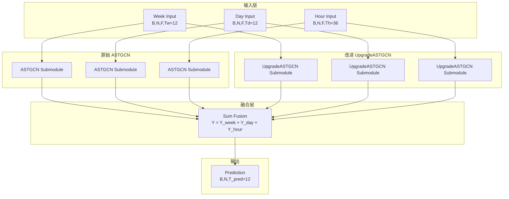
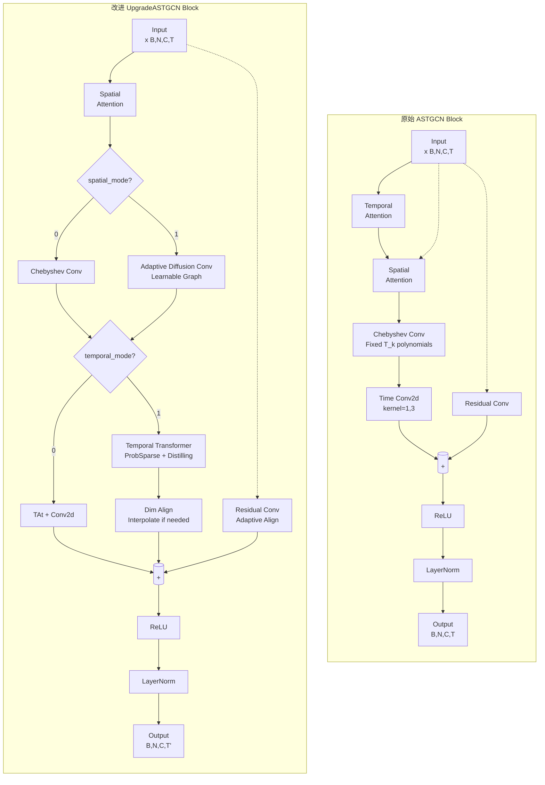

# ASTGCN 架构对比分析：原始版与改进版

本文档详细对比原始 ASTGCN 架构与我们改进后的 UpgradeASTGCN 架构，包含完整的数据流说明和架构图。

---

## 一、整体架构概览

### 1.1 三分支并行结构（两种架构共有）

```
┌─────────────────────────────────────────────────────────────────────────────┐
│                           Input: Three Time Scales                          │
│  ┌─────────────┐    ┌─────────────┐    ┌─────────────┐                       │
│  │ Week Branch │    │ Day Branch  │    │Hour Branch  │                       │
│  │  (周尺度)   │    │  (日尺度)   │    │ (近邻小时)  │                       │
│  └──────┬──────┘    └──────┬──────┘    └──────┬──────┘                       │
│         │                  │                  │                              │
│         ▼                  ▼                  ▼                              │
│  ┌─────────────┐    ┌─────────────┐    ┌─────────────┐                       │
│  │  Submodule  │    │  Submodule  │    │  Submodule  │                       │
│  │ (ASTGCN_sub │    │ (ASTGCN_sub │    │ (ASTGCN_sub │                       │
│  │  or Upgrade)│    │  or Upgrade)│    │  or Upgrade)│                       │
│  └──────┬──────┘    └──────┬──────┘    └──────┬──────┘                       │
│         │                  │                  │                              │
│         └──────────────────┼──────────────────┘                              │
│                            ▼                                                │
│                     ┌─────────────┐                                         │
│                     │   Sum fusion │  Y_hat = Y_week + Y_day + Y_hour         │
│                     │   (求和融合) │                                         │
│                     └──────┬──────┘                                         │
│                            ▼                                                │
│                     ┌─────────────┐                                         │
│                     │   Output     │                                         │
│                     │(B, N, T_pred)│                                         │
│                     └─────────────┘                                         │
└─────────────────────────────────────────────────────────────────────────────┘
```

### 1.2 输入数据格式

**原始数据维度：**
```python
# 输入 (三条分支相同格式，不同时间长度)
x: (batch_size, num_of_vertices, num_of_features, num_of_timesteps)
   - B: batch size
   - N: 307 (PEMS04节点数)
   - F: 5 (原始3特征 + time_of_day + day_of_week)
   - T: 时间步长度 (week: 12, day: 12, hour: 36)

# 输出
Y_hat: (batch_size, num_of_vertices, num_for_prediction)
   - num_for_prediction: 12 (未来1小时，每5分钟一个点)
```

---

## 二、原始 ASTGCN 架构详解

### 2.1 ASTGCN Block 数据流

```
┌─────────────────────────────────────────────────────────────────────────────┐
│                           ASTGCN Block (原始版)                             │
│                                                                             │
│  Input: x (B, N, C_in, T_in)                                                │
│       │                                                                     │
│       ├─────────────────────────────────────┐                              │
│       │                                     │                              │
│       ▼                                     ▼                              │
│  ┌─────────┐    ┌─────────┐    ┌─────────┐                              │
│  │  TAt    │    │  SAt    │    │Residual │                              │
│  │(Temporal│    │(Spatial │    │  Conv   │                              │
│  │Attention)│   │Attention)│   │ (1x1)   │                              │
│  │         │    │         │    │         │                              │
│  │Output:  │    │Output:  │    │Output:  │                              │
│  │E (B,T,T)│    │S (B,N,N)│    │x_res    │                              │
│  └────┬────┘    └────┬────┘    └────┬────┘                              │
│       │              │              │                                     │
│       │              ▼              │                                     │
│       │       ┌─────────────┐       │                                     │
│       │       │ cheb_conv   │       │                                     │
│       │       │ _with_SAt   │◄──────┘                                     │
│       │       │             │  (S用于加权)                                 │
│       │       │ T_k * S     │                                             │
│       │       │ (Chebyshev  │                                             │
│       │       │ 多项式)     │                                             │
│       │       └──────┬──────┘                                             │
│       │              │                                                     │
│       ▼              ▼                                                     │
│  ┌─────────────────────────────────┐                                       │
│  │  Temporal Attention Fusion      │                                       │
│  │  x_TAt = x ⊗ E                  │  # 时间维度加权                        │
│  │  (B,N,C,T) @ (B,T,T)            │                                       │
│  └────────────────┬────────────────┘                                       │
│                   │                                                        │
│                   ▼                                                        │
│  ┌─────────────────────────────────┐                                       │
│  │  Time Conv2d (1x3 kernel)      │                                       │
│  │  kernel=(1,3), padding=(0,1)    │                                       │
│  │  spatial_gcn ──► time_conv     │                                       │
│  │  (B,N,C_chev,T) ──► (B,N,C_time│,T)                                    │
│  └────────────────┬────────────────┘                                       │
│                   │                                                        │
│                   ▼                                                        │
│  ┌─────────────────────────────────┐                                       │
│  │  Residual Addition + ReLU      │                                       │
│  │  output = ReLU(x_res + conv_out)│                                      │
│  └────────────────┬────────────────┘                                       │
│                   │                                                        │
│                   ▼                                                        │
│  ┌─────────────────────────────────┐                                       │
│  │  LayerNorm                       │                                       │
│  │  permute ──► LN ──► permute    │                                       │
│  └─────────────────────────────────┘                                       │
│                                                                             │
│  Output: (B, N, C_time, T)  # 保持时间维度不变                            │
└─────────────────────────────────────────────────────────────────────────────┘
```

### 2.2 关键组件详解

#### 2.2.1 Chebyshev Graph Convolution

```python
class cheb_conv_with_SAt:
    """
    K阶切比雪夫图卷积，结合空间注意力
    
    数学原理：
    - 切比雪夫多项式 T_k(L) 在缩放的拉普拉斯矩阵上定义
    - 利用预计算的 T_k 矩阵捕获多阶邻居信息
    - 空间注意力 S 动态加权不同邻居的重要性
    """
    
    # 输入
    x: (B, N, F_in, T)
    spatial_attention: (B, N, N)
    cheb_polynomials: [T_0, T_1, ..., T_{K-1}]  # 预计算，每个 (N, N)
    
    # 核心计算
    for t in range(T):
        graph_signal = x[:, :, :, t]  # (B, N, F_in)
        output = 0
        for k in range(K):
            T_k = cheb_polynomials[k]  # (N, N)，静态图结构
            T_k_with_at = T_k * spatial_attention  # 动态加权
            
            # 图卷积: 聚合邻居信息
            rhs = torch.bmm(T_k_with_at.permute(0, 2, 1), graph_signal)  # (B, N, F_in)
            
            # 特征变换: Theta_k (F_in, F_out)
            output += torch.matmul(rhs, Theta[k])  # (B, N, F_out)
```

**关键特点：**
- 使用预计算的切比雪夫多项式 (基于静态邻接矩阵)
- K 通常设为 3，捕获 0/1/2 阶邻居
- 空间注意力对静态图进行动态加权

#### 2.2.2 空间注意力机制 (SAt)

```
┌────────────────────────────────────────┐
│      Spatial Attention Layer           │
│                                        │
│  Input: x (B, N, C, T)                 │
│                                        │
│  计算流程:                              │
│  1. lhs = ((x @ W_1) @ W_2)            │
│          (B,N,C,T)─►(B,N,T)─►(B,N,N?)  │
│                                        │
│  2. rhs = tensordot(W_3, x)            │
│          (B, T, N)                     │
│                                        │
│  3. product = lhs @ rhs                 │
│          (B, N, N)                     │
│                                        │
│  4. S = softmax(V_s @ sigmoid(product + b_s))
│          (B, N, N)  # 空间注意力矩阵    │
│                                        │
│  Output: S_normalized (B, N, N)        │
│  每个节点对其他所有节点的注意力权重    │
└────────────────────────────────────────┘
```

#### 2.2.3 时间注意力机制 (TAt)

```
┌────────────────────────────────────────┐
│      Temporal Attention Layer          │
│                                        │
│  Input: x (B, N, C, T)                 │
│                                        │
│  计算流程:                              │
│  类似空间注意力，但在时间维度上计算      │
│                                        │
│  Output: E_normalized (B, T, T)        │
│  每个时间点对其他时间点的注意力权重      │
│  体现"哪些历史时刻对当前预测更重要"    │
└────────────────────────────────────────┘
```

### 2.3 ASTGCN Submodule 结构

```
┌─────────────────────────────────────────────────────────────┐
│                    ASTGCN Submodule                         │
│                                                             │
│  Input: x (B, N, C_in, T_in)                                │
│       │                                                     │
│       ▼                                                     │
│  ┌─────────────────┐                                        │
│  │   Block 1       │  # 第一个ASTGCN_block                 │
│  │   (C_in ──► C1) │                                       │
│  └────────┬────────┘                                        │
│           │                                                 │
│           ▼                                                 │
│  ┌─────────────────┐                                        │
│  │   Block 2       │  # 可选的第二个block                 │
│  │   (C1 ──► C2)   │                                       │
│  └────────┬────────┘                                        │
│           │                                                 │
│           ▼                                                 │
│  ┌─────────────────────────────┐                            │
│  │   final_conv (LazyConv2d)  │                           │
│  │   kernel=(1, C_last)       │  # 沿通道维度卷积          │
│  │   output: (B, N, T_pred, 1) │                           │
│  └────────┬───────────────────┘                            │
│           │                                                 │
│           ▼                                                 │
│  ┌─────────────────────────────┐                            │
│  │   W (节点权重调制)           │                           │
│  │   Lazy初始化                │                           │
│  │   output *= W               │                           │
│  └────────┬───────────────────┘                            │
│           │                                                 │
│           ▼                                                 │
│  Output: (B, N, T_pred)  # 每个节点未来T_pred步的预测       │
└─────────────────────────────────────────────────────────────┘
```

### 2.4 原始 ASTGCN 的局限

| 局限 | 说明 |
|------|------|
| **静态图结构** | 切比雪夫多项式基于预计算的固定邻接矩阵，无法适应路网动态变化 |
| **局部时间建模** | 时间卷积仅捕获局部时序模式，难以建模长距离依赖 |
| **Lazy初始化风险** | 参数在 forward 中延迟创建，容易导致维度不匹配错误 |
| **僵化输出层** | `final_conv` 的 kernel size 固定，不够灵活 |

---

## 三、改进版 UpgradeASTGCN 架构详解

### 3.1 核心改进总览

```
┌─────────────────────────────────────────────────────────────────────────┐
│                    UpgradeASTGCN 核心改进                                │
│                                                                         │
│  ┌─────────────────────┐    ┌─────────────────────┐                    │
│  │   空间维度升级       │    │   时间维度升级       │                    │
│  │   spatial_mode       │    │   temporal_mode     │                    │
│  │                      │    │                      │                    │
│  │  0: 原始Chebyshev   │    │  0: 原始TAt+Conv    │                    │
│  │  1: 自适应扩散卷积  │◄───┤  1: Informer        │◄───┐               │
│  │     (AdaptiveDiff)│    │     Transformer     │    │               │
│  │                     │    │                      │    │               │
│  │  • 动态图学习       │    │  • ProbSparse Attn  │    │               │
│  │  • 扩散卷积核       │    │  • 时间蒸馏         │    │               │
│  │  • 更数学严谨       │    │  • 长距离依赖       │    │               │
│  └─────────────────────┘    └─────────────────────┘    │               │
│                                                        │               │
│  ┌─────────────────────────────────────────────────┐    │               │
│  │           配置组合 (4种模式)                      │    │               │
│  │  (0,0): 原始ASTGCN                             │    │               │
│  │  (0,1): Chebyshev + Transformer               │◄───┘               │
│  │  (1,0): AdaptiveDiff + Original Temp         │                    │
│  │  (1,1): 全升级版本 ← 我们的主要创新            │                    │
│  └─────────────────────────────────────────────────┘                    │
│                                                                         │
│  额外修复:                                                               │
│  ✓ 严格参数初始化 (非Lazy)                                              │
│  ✓ LazyLinear 输出层                                                    │
│  ✓ 维度自适应处理                                                       │
└─────────────────────────────────────────────────────────────────────────┘
```

### 3.2 UpgradeASTGCN Block 详细数据流

```
┌─────────────────────────────────────────────────────────────────────────────┐
│                        UpgradeASTGCN Block (改进版)                         │
│                                                                             │
│  Input: x (B, N, C_in, T_in)                                                │
│       │                                                                     │
│       ├─────────────────────────────────────────────────────────┐          │
│       │                                                         │          │
│       ▼                                                         ▼          │
│  ┌─────────┐                                              ┌─────────────┐ │
│  │  SAt    │                                              │ ResidualConv │ │
│  │ (共享)  │                                              │  (1x1 Conv)  │ │
│  │Output:  │                                              │  C_in ──►   │ │
│  │S (B,N,N)│                                              │  C_time      │ │
│  └────┬────┘                                              └──────┬──────┘ │
│       │                                                         │          │
│       │                    空间卷积分支选择                      │          │
│       │        ┌─────────────────────────────────┐                │          │
│       │        │                                 │                │          │
│       ▼        ▼                                 ▼                │          │
│  ┌─────────────────────────┐    ┌──────────────────────────────┐ │          │
│  │  if spatial_mode == 0:   │    │  if spatial_mode == 1:       │ │          │
│  │                          │    │                              │ │          │
│  │  cheb_conv_with_SAt      │    │  AdaptiveDiffusionConv       │ │          │
│  │  ├─ 固定T_k多项式       │    │  ├─ AdaptiveGraph()          │ │          │
│  │  └─ S加权               │    │  │   动态学习邻接矩阵         │ │          │
│  │                          │    │  │   node_emb_src @ dst.T    │ │          │
│  │                          │    │  │   + sparse_ratio控制     │ │          │
│  │                          │    │  ├─ 扩散卷积核 I, A, A²...  │ │          │
│  │                          │    │  └─ S与adj融合            │ │          │
│  │  Output: (B,N,C_chev,T) │    │  Output: (B,N,C_chev,T)     │ │          │
│  └─────────────────────────┘    └──────────────────────────────┘ │          │
│                          │                      │                │          │
│                          └──────────┬───────────┘                │          │
│                                     ▼                             │          │
│                          spatial_gcn (B,N,C_chev,T)               │          │
│                                                                     │          │
│                          时间建模分支选择                            │          │
│              ┌─────────────────────────────────┐                    │          │
│              │                                 │                    │          │
│              ▼                                 ▼                    │          │
│  ┌─────────────────────────┐    ┌──────────────────────────────┐   │          │
│  │  if temporal_mode == 0:  │    │  if temporal_mode == 1:       │   │          │
│  │                          │    │                              │   │          │
│  │  TAt + TimeConv          │    │  TemporalTransformer         │   │          │
│  │  ├─ 计算E (B,T,T)        │    │  ├─ InputProj + PosEmbed      │   │          │
│  │  ├─ spatial_gcn @ E     │    │  ├─ ProbSparse Attention      │   │          │
│  │  └─ Conv2d(1,3)         │    │  │   (factor采样, Top-u Query) │   │          │
│  │                          │    │  ├─ Causal Conv               │   │          │
│  │                          │    │  ├─ Distilling Layers         │   │          │
│  │                          │    │  │   (长度减半, 步长2)         │   │          │
│  │  Output: (B,N,C_time,T) │    │  └─ time_features 可输入      │   │          │
│  │                          │    │                              │   │          │
│  │                          │    │  Output: (B,N,C_time,T')     │   │          │
│  │                          │    │  (T'可能因蒸馏而改变)         │   │          │
│  └─────────────────────────┘    └──────────────────────────────┘   │          │
│                          │                      │                   │          │
│                          └──────────┬───────────┘                   │          │
│                                     ▼                               │          │
│                          time_conv_output (B,N,C_time,T_new)       │          │
│                                                                     │          │
│  ┌─────────────────────────────────────────────────────────┐       │          │
│  │           维度对齐与融合                                  │◄──────┘          │
│  │                                                          │                   │
│  │  # 处理时间维度不匹配 (当使用Transformer时)                │                   │
│  │  if T_new != T_residual:                               │                   │
│  │      x_residual = interpolate(x_residual, T_new)         │                   │
│  │                                                          │                   │
│  │  # 处理通道维度不匹配                                      │                   │
│  │  if C_residual != C_time:                                │                   │
│  │      x_residual = adjust_channels(x_residual)  # 截取或填充 │                   │
│  │                                                          │                   │
│  │  output = ReLU(x_residual + time_conv_output)            │                   │
│  │                                                          │                   │
│  │  # LayerNorm                                             │                   │
│  │  output = LN(output.permute(...)).permute(...)           │                   │
│  └─────────────────────────────────────────────────────────┘                   │
│                                                                     │          │
│  Output: (B, N, C_time, T_new)                                      │          │
│                                                                     │          │
│  关键改进:                                                          │          │
│  ✓ 空间建模可切换: 静态Chebyshev vs 动态AdaptiveDiff               │          │
│  ✓ 时间建模可切换: 局部Conv vs 长程Transformer                      │          │
│  ✓ 自动维度对齐: 处理Transformer可能改变时间维度的问题               │          │
│  ✓ 严格初始化: 所有参数在__init__中明确定义                          │          │
└─────────────────────────────────────────────────────────────────────────────┘
```

### 3.3 关键改进组件详解

#### 3.3.1 自适应图学习 (AdaptiveGraph)

```
┌─────────────────────────────────────────────────────────┐
│                 AdaptiveGraph 模块                      │
│                                                          │
│  核心思想: 不依赖预计算的距离矩阵，而是让模型自己学习    │
│            哪些路口之间应该存在连接，连接强度是多少       │
│                                                          │
│  参数:                                                   │
│  - node_emb_src: (N, embedding_dim)  # 源节点嵌入       │
│  - node_emb_dst: (N, embedding_dim)  # 目标节点嵌入       │
│                                                          │
│  计算流程:                                                │
│  1. logits = node_emb_src @ node_emb_dst.T              │
│           (N, d) @ (d, N) ──► (N, N)                   │
│                                                          │
│  2. 无向图处理 (可选):                                   │
│     logits = (logits + logits.T) / 2                   │
│                                                          │
│  3. ReLU激活 + Softmax归一化                             │
│     adj = softmax(ReLU(logits), dim=1)                   │
│                                                          │
│  4. 稀疏化控制 (可选):                                   │
│     if sparse_ratio > 0:                               │
│         k = (1 - sparse_ratio) * N                     │
│         保留top-k，其余置0                               │
│         行归一化                                         │
│                                                          │
│  Output: adj (N, N)  # 可学习的动态邻接矩阵              │
│                                                          │
│  优势:                                                   │
│  ✓ 不需要预先知道路网拓扑                                 │
│  ✓ 可以学习隐式连接 (如功能相似但距离远的节点)            │
│  ✓ 稀疏控制防止过拟合                                     │
└─────────────────────────────────────────────────────────┘
```

**代码实现:**
```python
class AdaptiveGraph(nn.Module):
    def forward(self):
        # 通过节点嵌入学习邻接关系
        logits = torch.matmul(self.node_emb_src, self.node_emb_dst.t())
        
        # 对称化处理（无向图）
        if not self.directed:
            logits = (logits + logits.t()) * 0.5
        
        # 激活与归一化
        logits = F.relu(logits)
        adj = torch.softmax(logits, dim=1)
        
        # 稀疏化
        if self.sparse_ratio > 0:
            k = max(1, int((1.0 - self.sparse_ratio) * self.num_nodes))
            topk = torch.topk(adj, k=k, dim=1)
            mask = torch.zeros_like(adj)
            mask.scatter_(1, topk.indices, 1.0)
            adj = adj * mask
            # 重新归一化
            row_sum = adj.sum(dim=1, keepdim=True)
            adj = torch.where(row_sum > 0, adj / row_sum, adj)
        
        return adj
```

#### 3.3.2 自适应扩散卷积 (AdaptiveDiffusionConv)

```
┌─────────────────────────────────────────────────────────────┐
│              AdaptiveDiffusionConv 详解                      │
│                                                              │
│  为什么不用Chebyshev？                                       │
│  - Chebyshev要求图拉普拉斯矩阵的特征值在[-1,1]之间           │
│  - 自适应学习的邻接矩阵不一定满足这个条件                      │
│  - 扩散卷积更数学严谨，适用于任意邻接矩阵                    │
│                                                              │
│  扩散过程定义:                                               │
│  - P = D^{-1}A  # 随机游走转移矩阵                          │
│  - 但这里简化使用: supports = [I, A, A², A³, ...]          │
│                                                              │
│  输入:                                                       │
│  - x: (B, N, C_in, T)                                        │
│  - spatial_attention: (B, N, N)                              │
│  - adaptive_graph(): (N, N)  # 动态邻接矩阵                  │
│                                                              │
│  计算流程:                                                   │
│  1. 获取动态邻接矩阵并与空间注意力融合                       │
│     adj = adaptive_graph()  # (N, N)                        │
│     adj = adj * spatial_attention  # (B, N, N)             │
│                                                              │
│  2. 构建扩散支撑矩阵 (I, A, A², ..., A^{K-1})               │
│     supports[0] = I                                          │
│     supports[1] = adj                                      │
│     supports[k] = supports[k-1] @ adj  # k阶邻居           │
│                                                              │
│  3. 对每个时间步进行图卷积                                   │
│     for t in T:                                              │
│         graph_signal = x[:, :, :, t]  # (B, N, C_in)        │
│         output = Σ_k supports[k] @ graph_signal @ Theta[k]   │
│                                                              │
│  4. 拼接所有时间步，ReLU激活                                 │
│     output: (B, N, C_out, T)                                 │
│                                                              │
│  参数:                                                       │
│  - Theta: (K, C_in, C_out)  # 每阶的权重矩阵，严格初始化    │
└─────────────────────────────────────────────────────────────┘
```

**数学对比:**

| 特性 | Chebyshev | Adaptive Diffusion |
|------|-----------|-------------------|
| 图结构 | 预计算静态 | 动态学习 |
| 多项式基 | T_k(L) 正交多项式 | I, A, A², ... 扩散幂 |
| 适用条件 | 要求特征值∈[-1,1] | 任意邻接矩阵 |
| 与注意力结合 | T_k * S | (A * S)^k |
| 数学严谨性 | 依赖归一化拉普拉斯 | 直接随机游走扩散 |

#### 3.3.3 时间Transformer (TemporalTransformer)

```
┌─────────────────────────────────────────────────────────────────────────┐
│                      TemporalTransformer 架构                           │
│                                                                          │
│  基于 Informer 的 ProbSparse Attention + 时间蒸馏                        │
│                                                                          │
│  整体结构 (e_layers 个编码器层):                                          │
│  ┌─────────────────────────────────────────────────────────────────┐   │
│  │  Input: x (B* N, T, C_in)  # 所有节点展平，独立处理时序          │   │
│  │                                                                  │   │
│  │  1. 输入投影 + 位置编码 + 时间特征                               │   │
│  │     x = InputProj(x)  # (B*N, T, d_model)                        │   │
│  │     x += pos_scale * PositionalEncoding                          │   │
│  │     if time_features:                                            │   │
│  │         x += temporal_scale * TemporalProj(time_features)        │   │
│  │                                                                  │   │
│  │  2. 堆叠 e_layers 个编码器层                                      │   │
│  │     for i in range(e_layers):                                    │   │
│  │         ┌─────────────────────────────────────────────────────┐   │   │
│  │         │  Encoder Layer i                                   │   │   │
│  │         │  ├─ CausalConv1d: 防止未来信息泄露                 │   │   │
│  │         │  ├─ ProbSparseAttention: 稀疏自注意力              │   │   │
│  │         │  │   ├─ factor * log(L) 采样Query                  │   │   │
│  │         │  │   ├─ Top-u 显著Query选择                         │   │   │
│  │         │  │   └─ 其余Query用V的mean填充                      │   │   │
│  │         │  ├─ FFN: 前馈网络                                  │   │   │
│  │         │  └─ 3个LayerNorm残差连接                           │   │   │
│  │         └─────────────────────────────────────────────────────┘   │   │
│  │                                                                  │   │
│  │     3. 时间蒸馏 (除最后一层外)                                    │   │
│  │        if i < e_layers - 1:                                      │   │
│  │            x = DistillingLayer(x)  # T ──► T/2                  │   │
│  │            Conv1d + MaxPool(kernel=3, stride=2)                  │   │
│  │                                                                  │   │
│  │  Output: (B*N, T', d_model)  # T'可能小于T                     │   │
│  └─────────────────────────────────────────────────────────────────┘   │
│                                                                          │
│  ProbSparse Attention 核心:                                              │
│  - 传统Attention: 所有Query与所有Key计算，O(L²)                        │
│  - ProbSparse: 只选择"重要"的Query，O(L log L)                          │
│  - 重要Query判断: M(q_i) = max(q_i·K) - mean(q_i·K)                   │
│    值越大表示该Query与Key的分布差异越大，信息量越大                      │
└─────────────────────────────────────────────────────────────────────────┘
```

**ProbSparseAttention 伪代码:**
```python
class ProbSparseAttention:
    def forward(self, x, attn_mask):
        # 生成 Q, K, V
        Q = self.q_proj(x).view(B, H, L, D)  # (B, n_heads, L, head_dim)
        K = self.k_proj(x).view(B, H, L, D)
        V = self.v_proj(x).view(B, H, L, D)
        
        # 1. 稀疏采样
        U_part = factor * log(L)  # 采样数量
        sample_k = min(U_part, L)
        K_sample = K[:, :, random_sample(sample_k), :]  # 随机采样部分Key
        
        # 2. 计算稀疏性分数
        Q_K_sample = Q @ K_sample.T  # (B, H, L, sample_k)
        M = Q_K_sample.max(dim=-1) - Q_K_sample.mean(dim=-1)  # (B, H, L)
        
        # 3. 选择Top-u个显著Query
        u = min(U_part, L)
        M_top = M.topk(u, dim=-1)  # 获取最重要的u个Query的索引
        Q_reduce = Q[:, :, M_top.indices, :]  # (B, H, u, D)
        
        # 4. 仅对显著Query计算完整Attention
        Q_K = Q_reduce @ K.T  # (B, H, u, L)
        Q_K = Q_K + attn_mask  # 应用因果掩码
        attn = softmax(Q_K, dim=-1)
        out_reduce = attn @ V  # (B, H, u, D)
        
        # 5. 对其他Query使用V的mean填充
        out = V.mean(dim=-2).expand(B, H, L, D).clone()
        out[:, :, M_top.indices, :] = out_reduce
        
        return out_proj(out)
```

### 3.4 UpgradeASTGCN Submodule 改进

```
┌─────────────────────────────────────────────────────────────────┐
│                 UpgradeASTGCN Submodule 改进                   │
│                                                                  │
│  主要改进:                                                       │
│  1. 严格参数初始化 (修复Lazy初始化问题)                          │
│  2. LazyLinear 输出层 (更灵活)                                   │
│                                                                  │
│  结构:                                                           │
│  Input: x (B, N, C_in, T_in)                                     │
│       │                                                          │
│       ▼                                                          │
│  ┌─────────────────┐    ┌─────────────────┐    ┌───────────────┐  │
│  │   Block 1       │───►│   Block 2       │───►│  ...          │  │
│  │   (可配置)      │    │   (可配置)      │    │  (可配置)     │  │
│  └─────────────────┘    └─────────────────┘    └───────┬───────┘  │
│                                                        │          │
│                                                        ▼          │
│  ┌─────────────────────────────────────────────────────────┐     │
│  │   展平: reshape(B, N, C_out * T_out)                    │     │
│  │        (B, N, C, T) ──► (B, N, C*T)                     │     │
│  └─────────────────────────────────────────────────────────┘     │
│       │                                                          │
│       ▼                                                          │
│  ┌─────────────────────────────────────────────────────────┐     │
│  │   LazyLinear(num_for_prediction)                        │     │
│  │   自动推断输入维度，无需预定义                           │     │
│  │   (B, N, C*T) ──► (B, N, T_pred)                       │     │
│  └─────────────────────────────────────────────────────────┘     │
│       │                                                          │
│       ▼                                                          │
│  ┌─────────────────────────────────────────────────────────┐     │
│  │   W: (N, T_pred)  # 严格初始化                           │     │
│  │   output *= W  # 节点级权重调制                          │     │
│  └─────────────────────────────────────────────────────────┘     │
│       │                                                          │
│       ▼                                                          │
│  Output: (B, N, T_pred)                                          │
│                                                                  │
│  优势:                                                           │
│  ✓ final_linear 是 LazyLinear，自动适配输入维度                  │
│  ✓ W 在 __init__ 中明确初始化，非Lazy                            │
│  ✓ 避免原始代码中维度不匹配导致的RuntimeError                    │
└─────────────────────────────────────────────────────────────────┘
```

### 3.5 配置参数说明

```python
# 空间模式
spatial_mode = 0  # 使用原始 Chebyshev 卷积
spatial_mode = 1  # 使用自适应扩散卷积

# 时间模式
temporal_mode = 0  # 使用原始时间注意力 + 1D卷积
temporal_mode = 1  # 使用 Informer Transformer

# 自适应图配置
adaptive_graph_cfg = {
    'embedding_dim': 10,      # 节点嵌入维度
    'sparse_ratio': 0.0,      # 稀疏比例 (0表示不稀疏)
    'directed': True          # 是否学习有向图
}

# Transformer配置
transformer_cfg = {
    'd_model': 64,            # 模型维度
    'n_heads': 4,             # 注意力头数
    'e_layers': 2,            # 编码器层数
    'dropout': 0.1,
    'max_len': 36,            # 最大序列长度
    'factor': 5               # ProbSparse采样因子
}
```

---

## 四、架构对比总结

### 4.1 组件级别对比

| 组件 | 原始 ASTGCN | UpgradeASTGCN | 改进价值 |
|------|-------------|---------------|----------|
| **空间卷积** | Chebyshev + 固定图 | **可选**: Chebyshev **或** 自适应扩散卷积 | 动态图学习，适应隐式连接 |
| **图结构** | 预计算距离矩阵 | **AdaptiveGraph** 学习节点嵌入 | 无需预定义拓扑，数据驱动 |
| **时间建模** | TAt + Conv1d (局部) | **可选**: TAt+Conv **或** Transformer (长程) | 捕获长距离时序依赖 |
| **注意力机制** | 标准Self-Attention | **ProbSparse Attention** | O(L²) → O(L log L)，更高效 |
| **参数初始化** | Lazy初始化 | **严格__init__初始化** | 避免运行时维度错误 |
| **输出层** | LazyConv2d | **LazyLinear** | 更灵活，自动适配维度 |
| **时间维度处理** | 固定长度 | **蒸馏层动态压缩** | 多尺度时间特征 |
| **残差连接** | 简单相加 | **自适应维度对齐** | 处理Transformer输出维度变化 |

### 4.2 数据流对比

```
┌─────────────────────────────────────────────────────────────────────────────┐
│                          数据流对比图                                        │
│                                                                             │
│  原始 ASTGCN Block:                                                         │
│  ┌─────────┐    ┌─────────┐    ┌─────────┐    ┌─────────┐                  │
│  │  Input  │───►│   TAt   │───►│   SAt   │───►│ cheb_conv│                 │
│  │ (B,N,C,T)    │         │    │         │    │  + SAt   │                 │
│  └─────────┘    └────┬────┘    └────┬────┘    └────┬────┘                 │
│                      │              │              │                       │
│                      │              │              ▼                       │
│                      │              │         ┌─────────┐                   │
│                      │              │         │Time Conv│                   │
│                      │              │         └────┬────┘                   │
│                      │              │              │                        │
│                      └──────────────┴──────────────┼─────► (+) ──► ReLU    │
│                                                   │                        │
│                                              (x_res)                       │
│                                                                             │
│  UpgradeASTGCN Block (全升级模式):                                           │
│  ┌─────────┐    ┌─────────┐    ┌─────────┐    ┌─────────────────────────┐  │
│  │  Input  │───►│   SAt   │───►│Adaptive │───►│ TemporalTransformer     │  │
│  │ (B,N,C,T)    │         │    │Diffusion│    │ ├─ ProbSparse Attn      │  │
│  └─────────┘    └────┬────┘    │  Conv   │    │ ├─ Causal Conv          │  │
│                      │         │ + SAt   │    │ ├─ FFN                  │  │
│                      │         └────┬────┘    │ └─ Distilling Layers    │  │
│                      │              │         └─────────────────────────┘  │
│                      │              │                   │                  │
│                      │              │                   ▼                  │
│                      │              │         (T'可能≠T，需维度对齐)       │
│                      │              │                   │                  │
│                      └──────────────┴───────────────────┼───► (+) ──► ReLU│
│                      (x_res，自适应插值到T')             │                  │
│                                                                             │
│  关键差异:                                                                   │
│  1. TAt移到了空间卷积之后(原始版TAt在空间卷积前)                            │
│  2. 时间建模从简单Conv升级为完整Transformer                                  │
│  3. 图卷积从Chebyshev升级为自适应扩散                                        │
│  4. 增加了维度对齐机制处理Transformer的变长输出                              │
└─────────────────────────────────────────────────────────────────────────────┘
```

### 4.3 性能预期对比

| 指标 | 原始 ASTGCN | UpgradeASTGCN | 预期改进 |
|------|-------------|---------------|----------|
| **训练速度** | 基准 | 略慢 (~20%) | Transformer计算量大 |
| **推理速度** | 基准 | 略慢 | 但支持更长的预测 |
| **长程依赖** | 受限 (局部卷积) | **显著增强** | Transformer捕获长距离模式 |
| **图适应性** | 静态 | **动态学习** | 适应路网结构变化 |
| **稀疏场景** | 固定连接 | **可配置稀疏** | 减少过拟合 |
| **内存占用** | 基准 | 略高 | 节点嵌入和Transformer参数 |
| **准确率** | 基准 | **预期提升** | 更强的建模能力 |

---

## 五、架构图 (Mermaid)

### 5.1 完整系统架构



### 5.2 ASTGCN Submodule 内部结构

```mermaid
graph LR
    subgraph Original["原始 ASTGCN Submodule"]
        direction TB
        O1[Input<br/>B,N,C,T] --> O2[Block 1]
        O2 --> O3[Block 2]
        O3 --> O4[LazyConv2d<br/>kernel=(1,C_last)]
        O4 --> O5[* W<br/>Lazy Init]
        O5 --> O6[Output<br/>B,N,T_pred]
    end
    
    subgraph Upgraded["改进 UpgradeASTGCN Submodule"]
        direction TB
        U1[Input<br/>B,N,C,T] --> U2[Block 1<br/>可配置]
        U2 --> U3[Block 2<br/>可配置]
        U3 --> U4[reshape<br/>B,N,C*T]
        U4 --> U5[LazyLinear<br/>T_pred]
        U5 --> U6[* W<br/>严格Init]
        U6 --> U7[Output<br/>B,N,T_pred]
    end
```

### 5.3 Block 级别对比



### 5.4 自适应图学习 vs 静态图

```mermaid
graph LR
    subgraph Static["原始: 静态图"]
        S1[distance.csv] --> S2[Adjacency Matrix<br/>Fixed]
        S2 --> S3[Chebyshev<br/>Polynomials<br/>Precomputed]
        S3 --> S4[Spatial<br/>Attention S]
        S4 --> S5[T_k * S]
    end
    
    subgraph Adaptive["改进: 自适应图"]
        A1[Node Embeddings<br/>src/dst: N x d] --> A2[Learnable<br/>Adjacency<br/>softmax(emb@emb.T)]
        A2 --> A3[Spatial<br/>Attention S]
        A3 --> A4[adj * S]
        A4 --> A5[Diffusion<br/>I, A, A²...]
    end
```

### 5.5 时间建模对比

```mermaid
graph LR
    subgraph OriginalTemp["原始: 局部时间建模"]
        direction TB
        OT1[Temporal Attention<br/>E: B,T,T] --> OT2[Matrix Multiply<br/>x @ E]
        OT2 --> OT3[Conv2d<br/>kernel=1,3<br/>Local receptive field]
    end
    
    subgraph UpgradeTemp["改进: Transformer时间建模"]
        direction TB
        UT1[Input + PosEmbed<br/>+ Time Features] --> UT2[Causal Conv1d]
        UT2 --> UT3[ProbSparse Attention<br/>O(L log L)]
        UT3 --> UT4[FFN]
        UT4 --> UT5[Distilling<br/>T -> T/2]
        UT5 --> UT6[Stack x e_layers]
    end
```

---

## 六、关键设计决策说明

### 6.1 为什么保留三分支结构？

```
交通数据具有强周期性：
- 周尺度: 捕获"每周同一时刻"的模式（如每周一早高峰）
- 日尺度: 捕获"每天同一时刻"的模式（如每天早高峰）
- 近邻小时: 捕获最近几小时的动态变化

这种设计是ASTGCN的核心创新，我们予以保留。
改进集中在每个分支内部的时空建模能力。
```

### 6.2 为什么提供可配置模式？

```
四种组合 (spatial_mode, temporal_mode):
(0,0): 原始ASTGCN - 用于对比基准
(0,1): Chebyshev + Transformer - 验证时间升级效果
(1,0): AdaptiveDiff + Original - 验证空间升级效果
(1,1): 全升级版本 - 完整改进

目的:
1. 消融实验验证每个改进的有效性
2. 渐进式部署，降低风险
3. 适应不同场景需求（速度vs精度）
```

### 6.3 维度对齐的重要性

```python
# Transformer可能改变时间维度（蒸馏层T->T/2）
# 原始代码没有处理这个问题，会导致残差连接维度不匹配

# 我们的修复:
if x_residual.shape[-1] != t_new:
    x_residual = F.interpolate(x_residual, size=t_new, mode='nearest')

if x_residual.shape[2] != time_conv_output.shape[2]:
    # 通道维度不匹配也要处理
    # 截取或填充
```

---

## 七、总结

### 7.1 改进核心

| 方面 | 改进要点 |
|------|----------|
| **空间建模** | 静态Chebyshev → 动态自适应扩散卷积，图结构可学习 |
| **时间建模** | 局部卷积 → Informer Transformer，长程依赖 + 高效稀疏注意力 |
| **工程鲁棒** | Lazy初始化 → 严格初始化，自适应维度对齐 |
| **架构灵活** | 单一架构 → 可配置模块化设计，支持4种运行模式 |

### 7.2 预期收益

1. **准确率提升**: 更强的时空建模能力，尤其是长周期依赖
2. **适应性增强**: 动态图学习适应不同路网结构
3. **计算效率**: ProbSparse Attention保持高效，尽管模型更复杂
4. **可维护性**: 模块化设计便于后续迭代和调试

### 7.3 使用建议

```python
# 快速验证改进效果
trainer.run(spatial_mode=0, temporal_mode=0)  # 基准
trainer.run(spatial_mode=1, temporal_mode=0)  # 只升级空间
trainer.run(spatial_mode=0, temporal_mode=1)  # 只升级时间
trainer.run(spatial_mode=1, temporal_mode=1)  # 全升级

# 生产部署推荐
# 如果追求速度: (0,0) 或 (1,0)
# 如果追求精度: (1,1) 全升级版本
```

---

**文档版本**: v1.0
**最后更新**: 2026-04-14
**作者**: ASTGCN改进项目组
